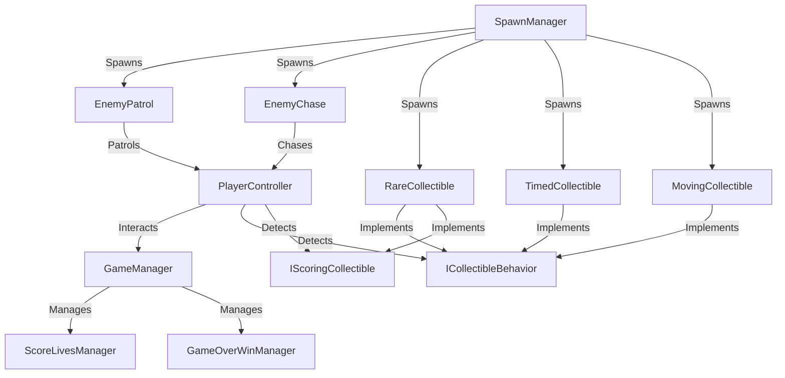
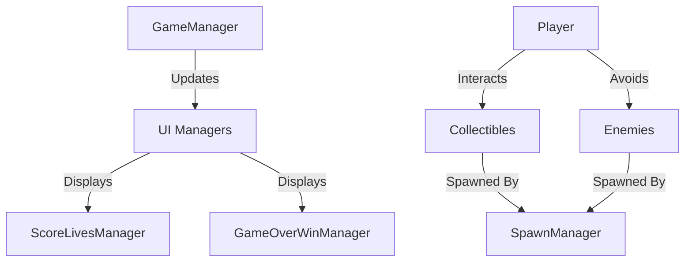

# Collect And Evoid- Escape the Grinches and Collect Hanukkah Donuts! 🎄🍩🕎

This repository contains the source code for a fun 2D collectible game built with Unity. Below, you’ll find instructions on how to run the game, a description of class relationships, assumptions, and architectural choices, as well as UML diagrams illustrating the game’s structure.

## 🕹️ How to Run the Game

1. **Clone the Repository**:
   ```bash
   git clone https://github.com/TwoBitCode/CollectAndAvoid
   ```

2. **Open in Unity**:
   - Open Unity Hub and add the cloned project to your list of projects.
   - Ensure you are using the correct Unity version (e.g., 2022.3 or later).

3. **Play the Game**:
   - Open the `Scene1` in the `Scenes` folder.
   - Press the "Play" button in Unity’s editor to run the game.

4. **Build the Game** (Optional):
   - Go to `File > Build Settings`.
   - Select your target platform (e.g., Windows, macOS, WebGL).
   - Click `Build` and run the resulting executable.

---

## 🏗️ Class Relationships

### 🌟 Core Classes

- **`GameManager`**:
  - Handles the game’s core logic, including score tracking, life management, and win/lose conditions.
  - Interacts with `ScoreLivesManager` and `GameOverWinManager` to update the UI and manage end-of-game events.

- **`PlayerController`**:
  - Manages player input and movement.
  - Detects collisions with collectibles and enemies, delegating scoring and life updates to the `GameManager`.

- **`SpawnManager`**:
  - Responsible for spawning enemies and collectibles at randomized intervals and positions.

### 🍩 Collectible Classes

- **`RareCollectible`**:
  - Provides bonus points to the player.
  - Features a **pulsating visual effect**, dynamically growing and shrinking during the last moments before disappearing.
  - The pulsating effect emphasizes urgency, encouraging the player to collect it quickly.

- **`TimedCollectible`**:
  - Moves in a circular motion and disappears after a set lifetime.

- **`MovingCollectible`**:
  - Oscillates vertically, making it harder to catch.

### 🧩 Enemy Classes

- **`EnemyPatrol`**:
  - Moves back and forth within a specified range, switching direction upon hitting walls.

- **`EnemyChase`**:
  - Actively pursues the player based on their position.

### 🎨 UI Management

- **`ScoreLivesManager`**:
  - Updates the UI with the player’s current score and lives.
  - Plays animations and sounds when the score or lives change.

- **`GameOverWinManager`**:
  - Manages the game-over and win panels, allowing the player to restart or quit the game.

### 🛠️ Interfaces

- **`ICollectibleBehavior`**:
  - Defines common behavior for all collectible types.

- **`IScoringCollectible`**:
  - Provides a method for returning the point value of a collectible.

---

## 🤔 Assumptions & Architectural Choices

1. **Single Responsibility Principle**:
   - Each class focuses on a specific task (e.g., `PlayerController` handles movement and collisions, while `GameManager` handles game state).

2. **Centralized Score Management**:
   - `GameManager` is the single source of truth for score and lives, ensuring consistency across the game.

3. **Extensibility with Interfaces**:
   - Interfaces like `ICollectibleBehavior` and `IScoringCollectible` make it easy to add new collectible types without modifying existing code.

4. **Constants for Key Values**:
   - Centralized constants (e.g., max lives, max score) improve maintainability and reduce magic numbers.

5. **Collision Optimization**:
   - Flags like `isCollected` prevent duplicate triggers, ensuring accurate scoring and behavior.

---

## 📊 Class Diagrams

### 🌟 UML Diagram (Class Relationships)



### 🛠️ Basic Architecture Diagram



---

## 📝 Additional Notes
- You can easily extend the game by creating new collectible or enemy types using the provided interfaces.
- Here is the text you need for adding the attribution:

---

### 🎵 Sound Attribution

- **CollectCoin.wav** by *bradwesson*  
  [Link to Source](https://freesound.org/s/135936/)  
  License: [Attribution NonCommercial 4.0](https://creativecommons.org/licenses/by-nc/4.0/)

- **platform game ding 9.wav** by *Robinhood76*  
  [Link to Source](https://freesound.org/s/672049/)  
  License: [Attribution NonCommercial 4.0](https://creativecommons.org/licenses/by-nc/4.0/)

--- 
